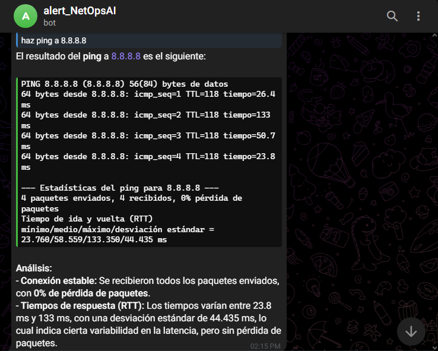
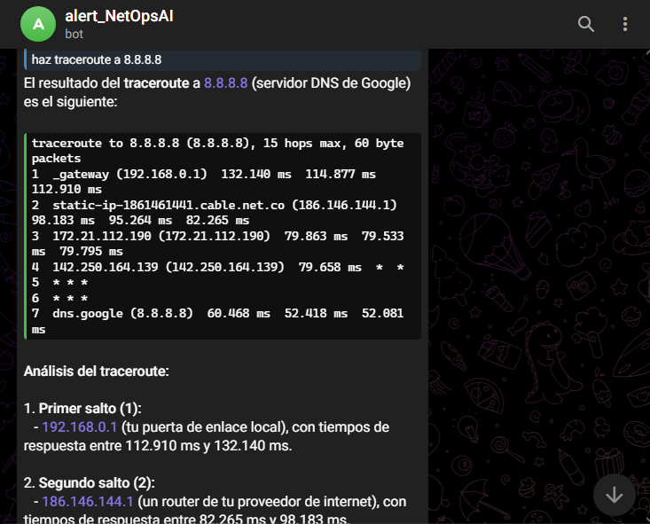
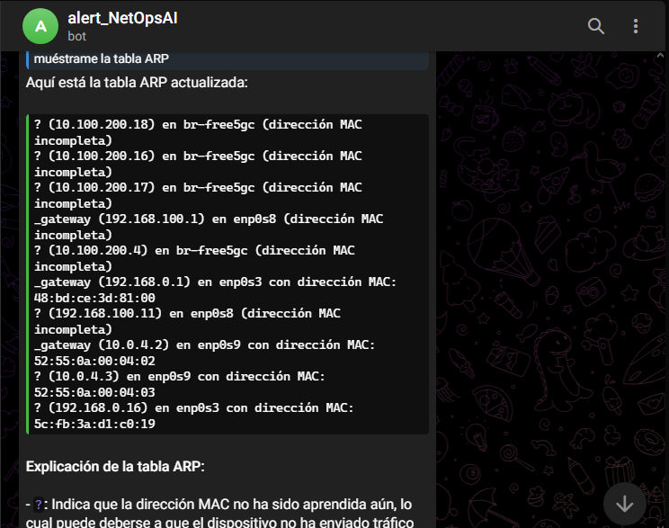
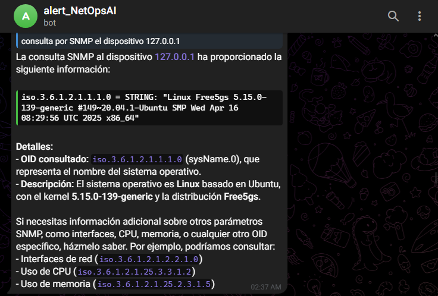
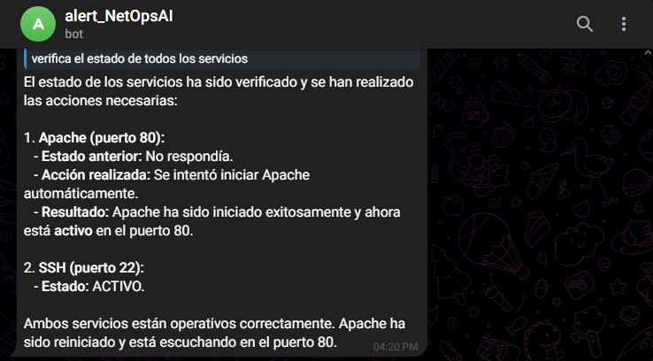
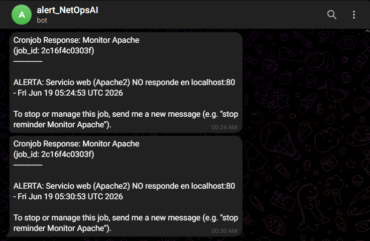
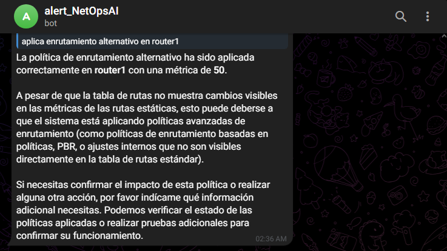
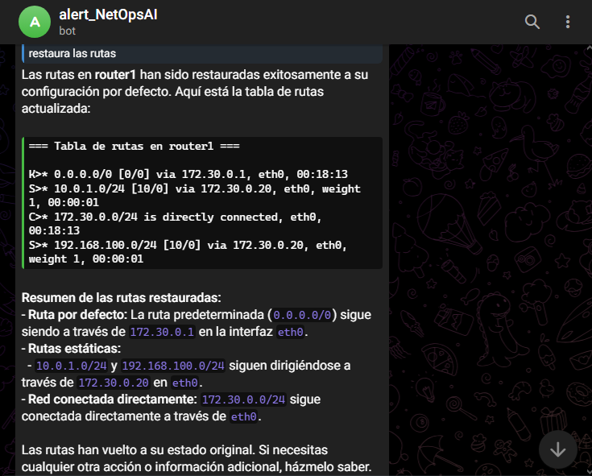

# NetOps AI — Agente Inteligente para Gestión de Fallas y Monitoreo de Redes

> Agente de administración de red nivel 1 y 2, accesible por Telegram, impulsado por un LLM local mediante Ollama y desplegado en Docker.

---

## Descripción general

**NetOps AI** es un agente inteligente que actúa como administrador de red de nivel 1 y 2 accesible directamente desde Telegram. El agente monitorea constantemente servicios críticos (Apache, SSH), ejecuta herramientas de diagnóstico de red (ping, traceroute, ARP, SNMP), gestiona políticas de enrutamiento sobre routers virtuales FRRouting y envía alertas proactivas ante fallos.

El sistema resuelve la necesidad de contar con un asistente de red disponible 24/7, capaz de diagnosticar y responder a incidentes sin intervención manual, todo desde una interfaz conversacional en Telegram.

**Tecnologías utilizadas:**

- [Hermes Agent](https://hermes-agent.nousresearch.com) (Nous Research) — framework del agente con soporte de skills, cron jobs y gateway Telegram
- Docker + Docker Compose — contenedorización del agente y los routers virtuales
- Node.js 20 — runtime base de Hermes Agent
- Python 3 — scripts de herramientas de red (skills)
- Ollama — motor de inferencia LLM local
- Telegram Bot API — canal de comunicación del agente
- FRRouting (FRR) — routers virtuales para simulación de enrutamiento

---

## Arquitectura del sistema

```
Usuario Telegram
       │
       ▼
┌─────────────────┐
│  Hermes Gateway  │  ← escucha mensajes del bot de Telegram
│  (puerto 8080)  │
└────────┬────────┘
         │
         ▼
┌─────────────────┐       ┌──────────────────────────┐
│   Hermes Agent  │──────▶│  Ollama (LLM local)       │
│  (contenedor    │       │  Llama-3-8B / Qwen2.5-7B  │
│   Docker)       │       │  http://localhost:11434    │
└────────┬────────┘       └──────────────────────────┘
         │
         ├──▶ network_tools.py   (ping, traceroute, ARP, SNMP)
         ├──▶ service_check.py   (estado Apache / SSH)
         ├──▶ routing_policy.py  (tablas de rutas en router1/router2)
         ├──▶ restart_apache.sh  (reinicio vía control_server.py)
         └──▶ monitor_service.sh (cron cada 5 min → alerta Telegram)

┌─────────────────┐   ┌─────────────────┐
│    router1      │   │    router2      │
│  FRR 172.30.0.10│   │  FRR 172.30.0.20│
└─────────────────┘   └─────────────────┘
      Red interna: 172.30.0.0/24
```

**Componentes:**

- **Hermes Gateway**: proceso principal del agente; mantiene la sesión de Telegram activa y enruta cada mensaje al LLM.
- **Skills / Tools**: scripts Python y Bash en `/root/.hermes/skills/network-tools/` que el agente invoca directamente desde la terminal.
- **Cron job nativo de Hermes**: ejecuta `monitor_service.sh` cada 5 minutos para vigilar Apache y notificar por Telegram si cae.
- **control_server.py**: servidor HTTP mínimo (`127.0.0.1:9999`) en la VM host que permite al contenedor ordenar reinicios de Apache sin privilegios sudo directos.
- **Routers virtuales (FRR)**: dos contenedores FRRouting que simulan una topología de red con rutas estáticas configurables desde el agente.

---

## Requisitos del sistema

> Los requisitos pueden variar dependiendo del uso de un modelo ejecutado en local o por medio de una API proporcionada por Ollama. En este caso se muestran los requisitos para el despliegue en local.

| Componente | Versión mínima | Notas |
|---|---|---|
| Docker | 24+ | Incluido en el Dockerfile |
| Docker Compose | v2 | `docker compose` (sin guion) |
| RAM | 16 GB | ~6 GB para el LLM, resto para SO y agente |
| vCPUs | 4 | Mínimo para inferencia cuantizada |
| Disco | 30 GB | Imagen Docker + modelo Ollama |
| Ollama | Cualquiera reciente | Instalado en la VM host, fuera del contenedor |

**Modelo LLM recomendado** (elegir uno):

```bash
ollama pull llama3:8b-instruct       # ~4.7 GB — recomendado
ollama pull qwen2.5:7b-instruct      # ~4.4 GB — alternativa
```

---

## Instalación paso a paso

### 1. Clonar el repositorio

```bash
https://github.com/BriyithNarvaez04/NetOps-AI-Enfasis-III-KPBG.git
cd hermes-docker
```

### 2. Instalar Ollama en la VM host

```bash
curl -fsSL https://ollama.com/install.sh | sh
ollama serve &          # dejar corriendo en segundo plano
ollama pull llama3:8b-instruct
```

### 3. Iniciar el servidor de control (VM host)

El `control_server.py` permite que el contenedor reinicie Apache en la VM sin acceso directo a sudo:

```bash
bash start_control_server.sh
```

Verifica que está corriendo:

```bash
curl http://127.0.0.1:9999/status_apache
```

### 4. Configurar variables de entorno

Edita `hermes-env/.env` con tus credenciales reales:

```env
TELEGRAM_BOT_TOKEN=<token de tu bot>
GATEWAY_ALLOW_ALL_USERS=true
TERMINAL_ENV=local
OPENAI_API_KEY=<clave de API Ollama o dejar el valor por defecto>
```

### 5. Construir y levantar los contenedores

```bash
docker compose build
docker compose up -d
```

Verifica que los tres contenedores estén corriendo:

```bash
docker compose ps
```

Deberías ver `hermes-netops`, `router1` y `router2` en estado `Up`.

---

## Descripción de archivos principales

| Archivo | Descripción |
|---|---|
| `Dockerfile` | Parte de `node:20-bookworm-slim` e instala herramientas de red del SO (`ping`, `traceroute`, `net-tools`, `snmp`, `netcat`, `iproute2`), luego Hermes Agent desde su script oficial y `python-telegram-bot` en su entorno virtual. Comando de inicio: `hermes gateway`. |
| `docker-compose.yml` | Orquesta tres servicios: **hermes** (agente con `network_mode: host`, `privileged: true`, capabilities `NET_RAW`/`NET_ADMIN` y socket de Docker montado), **router1** (`172.30.0.10`) y **router2** (`172.30.0.20`) como contenedores FRRouting en la subred `172.30.0.0/24`. |
| `control_server.py` | Servidor HTTP mínimo en `127.0.0.1:9999` (VM host). Expone `/start_apache`, `/stop_apache`, `/restart_apache` y `/status_apache`. Permite al contenedor ejecutar `systemctl` en la VM sin privilegios sudo directos, usando `subprocess` y devolviendo la salida como texto plano. |
| `start_control_server.sh` | Mata cualquier instancia previa de `control_server.py` y la relanza en segundo plano con `nohup`, redirigiendo la salida a `control_server.log`. |
| `hermes-data/system_prompt.md` | Cerebro de comportamiento del agente. Define las reglas absolutas (responder en español, nunca inventar salidas), el mapeo de intenciones a scripts y los flujos de diagnóstico paso a paso ante alertas de Apache o solicitudes de enrutamiento alternativo. |
| `hermes-data/AGENTS.md` | Versión compacta del prompt con los comandos exactos mapeados a cada intención, usada como referencia rápida interna por Hermes al construir el contexto de cada conversación. |
| `skills/network-tools/network_tools.py` | Cuatro acciones: `ping` (4 paquetes), `traceroute` (máx. 15 saltos), `arp` (tabla ARP del sistema) y `snmp` (SNMPv2c al OID de descripción). Incluye validación de entrada con `ipaddress` y regex para prevenir inyección de comandos. |
| `skills/network-tools/service_check.py` | Verifica Apache (puerto 80) y SSH (puerto 22) con `netcat`. Si un servicio no responde, ejecuta diagnóstico automático (`pgrep`, `ss -tlnp`, `systemctl status`) y devuelve el resultado formateado con emojis y recomendaciones listas para Telegram. |
| `skills/network-tools/routing_policy.py` | Gestiona rutas estáticas en los contenedores FRR via `docker exec <router> vtysh`. Acciones: `show` (tabla actual), `apply` (métrica alternativa configurable) y `restore` (métrica por defecto `10`). Opera sobre `10.0.1.0/24` y `192.168.100.0/24` vía gateway `172.30.0.20`. |
| `skills/network-tools/restart_apache.sh` | Verifica si Apache ya responde en puerto 80. Si no, llama a `127.0.0.1:9999/restart_apache`, espera 3 segundos y vuelve a verificar. Reporta el resultado en texto plano con emojis para Telegram. |
| `scripts/network-tools/monitor_service.sh` | Lanza un `curl` silencioso a `localhost:80` con timeout de 5 s. Si el código HTTP no es 2xx/3xx, imprime una línea de alerta con fecha que Hermes captura y reenvía al canal de Telegram. Ejecutado cada 5 minutos por el cron nativo de Hermes. |
| `routers/router2/frr.conf` | Rutas estáticas del router2 hacia `10.0.1.0/24` y `192.168.100.0/24` con gateway `172.30.0.10` y métrica `10`. Router1 no tiene `frr.conf` fijo porque sus rutas las gestiona dinámicamente `routing_policy.py`. |

---

## Skills / Tools del agente

Todos los scripts viven en `/root/.hermes/skills/network-tools/` dentro del contenedor.

### `network_tools.py` — Diagnóstico de red

| Acción | Comando directo |
|---|---|
| Ping | `python3 network_tools.py ping <IP>` |
| Traceroute | `python3 network_tools.py traceroute <IP>` |
| Tabla ARP | `python3 network_tools.py arp` |
| SNMP | `python3 network_tools.py snmp <IP> [community]` |

### `service_check.py` — Estado de servicios

| Acción | Comando directo |
|---|---|
| Estado Apache | `python3 service_check.py apache` |
| Estado SSH | `python3 service_check.py ssh` |
| Todo | `python3 service_check.py all` |

### `routing_policy.py` — Políticas de enrutamiento

| Acción | Comando directo |
|---|---|
| Ver rutas router1 | `python3 routing_policy.py show router1` |
| Ver rutas router2 | `python3 routing_policy.py show router2` |
| Enrutamiento alternativo | `python3 routing_policy.py apply router1 50` |
| Restaurar rutas | `python3 routing_policy.py restore router1` |

---

## Pruebas en terminal (`docker exec`)

Antes de probar desde Telegram, verifica que los scripts funcionan correctamente ejecutándolos directamente dentro del contenedor.

### Verificar que el contenedor está activo

```bash
docker compose ps
docker exec -it hermes-netops bash
```

### Pruebas de conectividad de red

```bash
# Ping a Google DNS
docker exec hermes-netops python3 /root/.hermes/skills/network-tools/network_tools.py ping 8.8.8.8

# Ping entre routers (red interna)
docker exec hermes-netops python3 /root/.hermes/skills/network-tools/network_tools.py ping 172.30.0.10
docker exec hermes-netops python3 /root/.hermes/skills/network-tools/network_tools.py ping 172.30.0.20

# Traceroute
docker exec hermes-netops python3 /root/.hermes/skills/network-tools/network_tools.py traceroute 8.8.8.8

# Tabla ARP
docker exec hermes-netops python3 /root/.hermes/skills/network-tools/network_tools.py arp

# SNMP (si hay un dispositivo con SNMP activo en la red)
docker exec hermes-netops python3 /root/.hermes/skills/network-tools/network_tools.py snmp 172.30.0.10
docker exec hermes-netops python3 /root/.hermes/skills/network-tools/network_tools.py snmp 172.30.0.10 public
```

### Pruebas de estado de servicios

```bash
# Verificar Apache (puerto 80)
docker exec hermes-netops python3 /root/.hermes/skills/network-tools/service_check.py apache

# Verificar SSH (puerto 22)
docker exec hermes-netops python3 /root/.hermes/skills/network-tools/service_check.py ssh

# Verificar ambos servicios con diagnóstico automático
docker exec hermes-netops python3 /root/.hermes/skills/network-tools/service_check.py all
```

### Pruebas de enrutamiento

```bash
# Ver tabla de rutas actual de router1
docker exec hermes-netops python3 /root/.hermes/skills/network-tools/routing_policy.py show router1

# Ver tabla de rutas actual de router2
docker exec hermes-netops python3 /root/.hermes/skills/network-tools/routing_policy.py show router2

# Aplicar enrutamiento alternativo (métrica 50)
docker exec hermes-netops python3 /root/.hermes/skills/network-tools/routing_policy.py apply router1 50

# Restaurar rutas por defecto (métrica 10)
docker exec hermes-netops python3 /root/.hermes/skills/network-tools/routing_policy.py restore router1
```

### Prueba del cron de monitoreo

```bash
# Ejecutar el script de monitoreo manualmente
docker exec hermes-netops bash /root/.hermes/scripts/network-tools/monitor_service.sh

# Si Apache está caído, debería imprimir algo como:
# ALERTA: Servicio web (Apache2) NO responde en localhost:80 - Thu Jun 19 03:15:00 UTC 2026
```

### Prueba del reinicio de Apache (desde el contenedor)

```bash
# Primero asegúrate de que control_server.py está corriendo en la VM host
curl http://127.0.0.1:9999/status_apache

# Luego prueba el script de reinicio
docker exec hermes-netops bash /root/.hermes/skills/network-tools/restart_apache.sh
```

### Verificar conectividad con Ollama

```bash
# Desde la VM host
curl http://localhost:11434/api/tags

# Desde dentro del contenedor (network_mode: host, así que es la misma dirección)
docker exec hermes-netops curl http://localhost:11434/api/tags
```

### Verificar tablas de rutas directamente en los routers FRR

```bash
# Acceder a la CLI de FRR en router1
docker exec -it router1 vtysh -c "show ip route"

# Acceder a la CLI de FRR en router2
docker exec -it router2 vtysh -c "show ip route"

# Ver interfaces de router1
docker exec -it router1 vtysh -c "show interfaces brief"
```

---

## Comandos recomendados en Telegram

Una vez el agente esté corriendo, prueba los siguientes mensajes en orden para validar cada funcionalidad:

### Conectividad básica

```
haz ping a 8.8.8.8
```
```
haz ping a 172.30.0.10
```
```
traceroute a 8.8.8.8
```
```
muéstrame la tabla ARP
```

### Consultas SNMP

```
consulta SNMP a 172.30.0.10
```
```
SNMP a 172.30.0.10 community public
```

### Estado de servicios

```
estado de apache
```
```
estado de SSH
```
```
estado de servicios
```

### Enrutamiento

```
muéstrame la tabla de rutas
```
```
@Hermes aplica enrutamiento alternativo en router1
```
```
restaura el enrutamiento
```

### Diagnóstico completo (flujo combinado)

```
@Hermes diagnostica el problema y aplica la política de enrutamiento alternativo
```

### Reinicio de Apache

```
reinicia apache
```
```
reactiva apache
```

---

## Estructura del proyecto

```
hermes-docker/
├── Dockerfile                        # Imagen del agente (Node.js 20 + herramientas de red)
├── docker-compose.yml                # Orquestación: hermes-netops, router1, router2
├── control_server.py                 # Servidor HTTP mínimo en VM host (puerto 9999)
├── start_control_server.sh           # Script para iniciar control_server.py
├── control_server.log                # Log del servidor de control
│
├── hermes-env/
│   └── .env                          # Variables de entorno (token Telegram, API key)
│
├── hermes-data/                      # Volumen montado en /root/.hermes del contenedor
│   ├── AGENTS.md                     # Personalidad y comandos rápidos del agente
│   ├── SOUL.md                       # Identidad base de Hermes Agent
│   ├── system_prompt.md              # Prompt del sistema: reglas y flujos de NetOps AI
│   │
│   ├── skills/
│   │   └── network-tools/
│   │       ├── SKILL.md              # Descripción del skill para el agente
│   │       ├── network_tools.py      # Ping, traceroute, ARP, SNMP
│   │       ├── service_check.py      # Verificación de Apache y SSH
│   │       ├── routing_policy.py     # Gestión de rutas en routers FRR
│   │       └── restart_apache.sh     # Reinicio de Apache vía control_server
│   │
│   ├── scripts/
│   │   └── network-tools/
│   │       └── monitor_service.sh    # Script de monitoreo (cron cada 5 min)
│   │
│   ├── cron/                         # Salidas del cron job de Hermes
│   ├── logs/                         # Logs del gateway y del agente
│   └── memories/                     # Memoria persistente del agente
│
└── routers/
    ├── router1/
    │   └── daemons                   # Configuración de demonios FRR
    └── router2/
        ├── daemons
        └── frr.conf                  # Rutas estáticas del router2
```

---

## Despliegue con Docker

```bash
# Construir imágenes
docker compose build

# Levantar todos los servicios en segundo plano
docker compose up -d

# Ver logs en tiempo real del agente
docker compose logs -f hermes

# Reiniciar solo el agente
docker compose restart hermes

# Detener todo
docker compose down
```

Para acceder al contenedor del agente:

```bash
docker exec -it hermes-netops bash
```

---

## Evidencias de pruebas

> Las capturas se encuentran en la carpeta `media`. 

### Ping a host externo



### Traceroute



### Tabla ARP



### SNMP



### Estado de servicios (Apache y SSH)



### Alerta automática de Apache caído



### Diagnóstico y enrutamiento alternativo



### Restauración de rutas



---

## Posibles errores y soluciones

### El bot de Telegram no responde

- Verifica que el token en `.env` es correcto.
- Comprueba que el contenedor está corriendo: `docker compose ps`.
- Revisa los logs: `docker compose logs hermes | tail -50`.
- Asegúrate de que `GATEWAY_ALLOW_ALL_USERS=true` está en el `.env`.

### Error de conexión a Ollama

- Verifica que Ollama está corriendo en la VM host: `curl http://localhost:11434/api/tags`.
- El contenedor usa `network_mode: host`, así que accede a `localhost:11434` directamente.
- Si usas Ollama remoto, revisa que `OLLAMA_API_URL` apunta al endpoint correcto.

### El contenedor no levanta

- Revisa que Docker tiene permisos para acceder al socket: `/var/run/docker.sock`.
- Verifica que los puertos no están ocupados: `ss -tlnp | grep 8080`.
- Comprueba los logs detallados: `docker compose logs hermes`.

### `routing_policy.py` falla con "Comando no encontrado"

- Verifica que `router1` y `router2` están corriendo: `docker ps | grep router`.
- El script usa `docker exec` internamente; el contenedor Hermes necesita acceso al socket de Docker (ya configurado en `docker-compose.yml`).

### `control_server.py` no responde

- Verifica que está corriendo: `pgrep -a python3 | grep control_server`.
- Si no, reinícialo: `bash start_control_server.sh`.
- Comprueba el log: `tail -20 ~/hermes-docker/control_server.log`.

### Cron de monitoreo no envía alertas

- Revisa la carpeta de salidas: `hermes-data/cron/output/` — deberían aparecer archivos `.md` cada 5 minutos.
- Verifica que Hermes está activo y conectado a Telegram con `docker compose logs -f hermes`.

---

## Notas de configuración adicional

- El contenedor corre con `privileged: true` y las capabilities `NET_RAW` / `NET_ADMIN` para que `ping` y `traceroute` funcionen correctamente dentro del contenedor.
- La red de los routers virtuales es `172.30.0.0/24`. `router1` tiene la IP `.10` y `router2` tiene la `.20`.
- El archivo `hermes-data/system_prompt.md` define el comportamiento completo del agente: idioma, flujos de diagnóstico y mapeo de intenciones a scripts.
---

##  Conclusión

NetOps AI demuestra cómo un agente de IA basado en LLM puede integrarse con herramientas tradicionales de administración de redes para automatizar tareas de nivel 1 y 2. Gracias a Hermes Agent, el sistema combina razonamiento en lenguaje natural con ejecución real de comandos de red, monitoreo proactivo mediante cron jobs y comunicación bidireccional a través de Telegram, todo dentro de un entorno Docker reproducible y optimizado para las restricciones de hardware de una máquina virtual.

---

*Universidad del Cauca — Énfasis III - Aplicaciones y Servicios Telemáticos 2026*
*Briyith Guacas y Karol Palechor*
